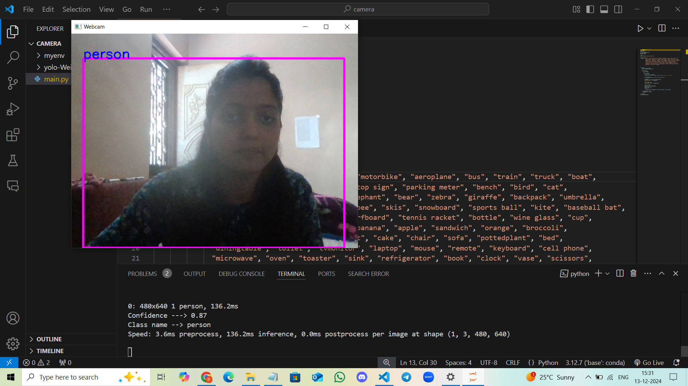

# **RealTime Object Detection Using YOLO**

This project implements a real-time object detection system using the YOLOv8 model. The system focuses exclusively on detecting "person" objects in a live webcam feed, ignoring other object classes. The implementation leverages the **Ultralytics YOLO** library and **OpenCV** for video processing, making it fast, accurate, and efficient.

---

## **Overview**

- **Objective**: Real-time detection and bounding box visualization for persons in a video stream.
- **Technology Stack**:
  - **YOLOv8**: A cutting-edge object detection model optimized for speed and precision.
  - **OpenCV**: For accessing and displaying the webcam feed.
  - **Python**: Programming language for implementation.
- **Key Features**:
  - Detects only "person" objects in the frame, ignoring all other classes.
  - Draws bounding boxes and displays confidence scores for detected persons.
  - Supports live webcam feeds with customizable video processing.

---

## **Installation Instructions**

Follow these steps to set up and run the project on your local machine:

### **Prerequisites**

1. **Python 3.7 or later** must be installed on your system.
2. **Webcam** (built-in or external) is required for live detection.
3. Ensure `pip` (Python package manager) is installed for dependency management.

### **Step 1: Clone the Repository**

Download or clone this project repository:
```bash
git clone <repository-url>
cd <project-folder>
```

### **Step 2: Create a Virtual Environment**

It’s recommended to use a virtual environment for managing dependencies:
```bash
python -m venv venv
```
Activate the virtual environment:
- **Windows**:
  ```bash
  venv\Scripts\activate
  ```
- **Mac/Linux**:
  ```bash
  source venv/bin/activate
  ```

### **Step 3: Install Dependencies**

Install the required libraries using `pip`:
```bash
pip install ultralytics opencv-python
```

### **Step 4: Download YOLOv8 Weights**

Ensure the YOLOv8 model weights (`yolov8n.pt`) are available. The script will download the weights automatically the first time you run the program.

---

## **How to Run**

1. Ensure your webcam is connected and functional.
2. Run the program:
   ```bash
   python main.py
   ```
3. The application will:
   - Open a live webcam feed.
   - Detect only "person" objects in the frame.
   - Display bounding boxes with confidence scores.

4. Press **`q`** to quit the application.

---

## **Output**

### **Live Detection Example:**



---

## **Features**

- **Real-time Person Detection**: The program detects "person" objects from a live webcam feed.
- **Bounding Boxes**: Draws bounding boxes and displays confidence scores for each detected person.
- **Focus on Efficiency**: Ignores all other object classes for a faster and more focused detection process.

---
